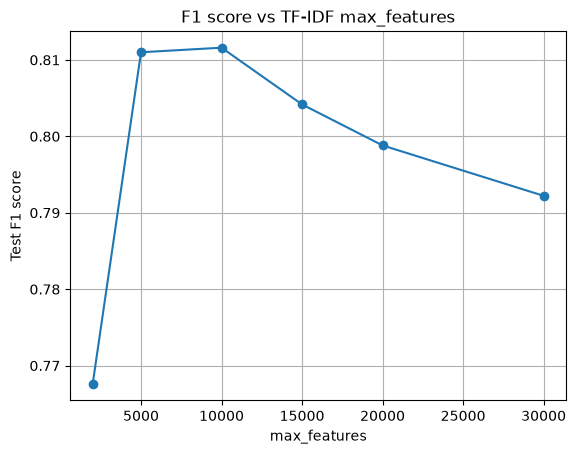
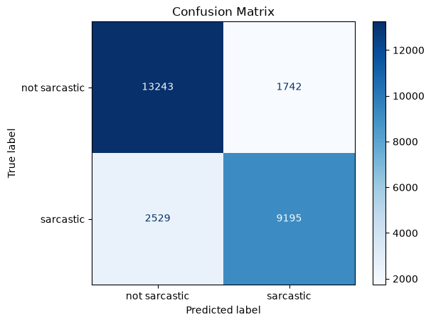

# Sarcasm Detection

A classical NLP pipeline that classifies news headlines as sarcastic or not, trained on
TF-IDF features with a regularized Logistic Regression model, and served through a
FastAPI endpoint.

## Data Source

[Sarcasm News Headline Dataset](https://huggingface.co/datasets/raquiba/Sarcasm_News_Headline)
(HuggingFace), 55,328 headlines pulled from two sources:

- **Sarcastic** headlines from [TheOnion.com](https://www.theonion.com)
- **Non-sarcastic** headlines from [HuffPost](https://www.huffpost.com)

The dataset ships with a pre-made train/test split (28,619 train / 26,709 test rows),
which this project uses as-is.

## Why Classical ML, Not Deep Learning

Headlines are short (a handful of tokens after cleaning), and sarcasm cues here are
largely lexical (specific word and phrase choices) rather than long-range contextual
patterns. A deep model (LSTM, transformer) adds training time, latency, and opacity
without a clear accuracy payoff on this kind of short-text task. TF-IDF + Logistic
Regression is fast to train, fast to serve, and the learned weights are directly
inspectable — you can see exactly which words push a prediction toward "sarcastic."

## Pipeline

```
download_data.py   → fetch dataset from HuggingFace, cache as CSV in data/
data_processing.py → clean text, TF-IDF vectorize (fit on train only)
train.py            → train Logistic Regression, save model + vectorizer
evaluate.py          → classification report + confusion matrix on test set
tune.py              → grid search TF-IDF max_features, plot F1 vs. max_features
api.py               → FastAPI endpoint serving live predictions
test_cases.py        → curated headlines exercising different prediction edge cases
```

### 1. Data Processing

Each headline is lowercased, stripped of punctuation, and stopword-filtered (NLTK's
English stopword list). Cleaned headlines are vectorized with `TfidfVectorizer` using
unigrams + bigrams. The vectorizer is **fit only on the training set** and used to
`transform` the test set — fitting on the full dataset would leak test-set vocabulary
statistics into training, inflating evaluation scores.

### 2. Training

Model: `LogisticRegression(solver="saga", penalty="l1")`

- **SAGA solver**: TF-IDF output is a large, sparse matrix. SAGA uses stochastic
  gradient updates, which scale better here than a full-batch solver like `lbfgs`,
  and it's the only sklearn solver that supports L1 regularization.
- **L1 penalty**: drives irrelevant feature weights to exactly zero, acting as
  built-in feature selection on top of the TF-IDF vocabulary cap.

The fitted model and vectorizer are saved as `model.joblib` and `vectorizer.joblib`
(binary, via `joblib`) so any later script — evaluation, the API, future SHAP analysis —
uses the exact same vocabulary and weights, with no risk of retraining drift.

### 3. Tuning

`tune.py` grid-searches the TF-IDF `max_features` cap and retrains a model for each
value, plotting test F1 against vocabulary size:



F1 peaks around **`max_features=10,000`** and declines past 15,000–20,000 as the
added features become increasingly rare, low-signal terms that don't generalize.
This empirically confirms `10,000` (the default used in `train.py`) as a
well-justified choice rather than an arbitrary one.

### 4. Evaluation

Run on the 26,709-row held-out test set:



| Metric | Value |
|---|---|
| Accuracy | 0.840 |
| Precision (sarcastic) | 0.841 |
| Recall (sarcastic) | 0.784 |
| F1 (sarcastic) | 0.812 |

The model is slightly more likely to miss sarcasm (false negatives: 2,529) than to
falsely flag genuine headlines as sarcastic (false positives: 1,742) — consistent
with sarcasm being a harder signal to catch via surface lexical features alone.

### 5. Serving

`api.py` loads the saved model and vectorizer once at startup and exposes:

```
POST /predict
{"headline": "Local Man Discovers Sarcasm, Nation Stunned"}

→ {"is_sarcastic": true, "confidence": 0.91}
```

Interactive Swagger docs are available at `/docs` once the server is running.

## Running the Pipeline

```bash
python download_data.py   # fetch + cache dataset
python train.py           # train and save model + vectorizer
python evaluate.py        # print metrics, save confusion matrix
python tune.py             # grid search max_features, save F1 plot
python api.py              # start the prediction API on localhost:8000
python test_cases.py       # exercise the running API with curated headlines
```

## Future Scope

- **Model explainability**: the saved vectorizer + linear model are a direct fit for
  SHAP's `LinearExplainer`, which would surface which words/bigrams drove each
  prediction — useful both for debugging misclassifications and for demonstrating
  model interpretability.
- **Error analysis**: inspect false negatives/positives directly (sarcasm relying on
  world knowledge or tone rather than lexical cues is the likely failure mode given
  the precision/recall gap above).
- **Stronger baselines for comparison**: an SVM or a calibrated ensemble could be
  benchmarked against the current Logistic Regression as a sanity check, without
  abandoning the classical-ML approach.
- **Cross-validation in `tune.py`**: current tuning uses a single train/test split per
  `max_features` value; k-fold cross-validation would give more reliable estimates,
  at the cost of additional training time.
- **Containerization**: a Dockerfile around `api.py` would make the service trivially
  deployable.
