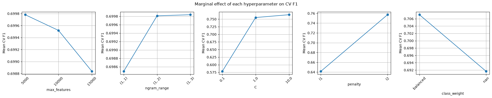
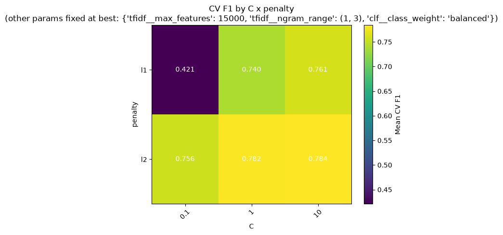

# Sarcasm Detection

A classical NLP pipeline that classifies news headlines as sarcastic or not, trained on
TF-IDF features with a regularized Logistic Regression model, and served through a
FastAPI endpoint.

## Data Source

[Sarcasm News Headline Dataset](https://huggingface.co/datasets/raquiba/Sarcasm_News_Headline)
(HuggingFace), 55,328 headlines pulled from two sources:

- **Sarcastic** headlines from [TheOnion.com](https://www.theonion.com)
- **Non-sarcastic** headlines from [HuffPost](https://www.huffpost.com)

The dataset ships with a pre-made train/test split, but that split has heavy overlap —
about 99.6% of the "test" headlines also appear verbatim in "train," which leaks test
data into training and inflates every downstream metric. This project instead combines
both splits, deduplicates by headline (55,328 rows → 28,503 unique), and re-splits
80/20 with stratification, giving 22,802 train / 5,701 test rows that are genuinely
held out.

## Why Classical ML, Not Deep Learning

Headlines are short (a handful of tokens after cleaning), and sarcasm cues here are
largely lexical (specific word and phrase choices) rather than long-range contextual
patterns. A deep model (LSTM, transformer) adds training time, latency, and opacity
without a clear accuracy payoff on this kind of short-text task. TF-IDF + Logistic
Regression is fast to train, fast to serve, and the learned weights are directly
inspectable — you can see exactly which words push a prediction toward "sarcastic."

## Pipeline

```
src/download_data.py   → fetch dataset from HuggingFace, cache as CSV in data/
src/data_processing.py → clean text, TF-IDF vectorize (fit on train only)
src/train.py            → train Logistic Regression, save model + vectorizer to artifacts/
src/evaluate.py         → classification report + confusion matrix, saved to eval_results/
src/tune.py             → grid search TF-IDF + model hyperparameters jointly, plots saved to tuning_results/
src/api.py              → FastAPI endpoint serving live predictions
src/test_cases.py       → curated headlines exercising different prediction edge cases
```

### 1. Data Processing

Each headline is lowercased, stripped of punctuation, and stopword-filtered (NLTK's
English stopword list). Cleaned headlines are vectorized with `TfidfVectorizer` using
an n-gram range configurable via `load_data(ngram_range=...)`. The vectorizer is
**fit only on the training set** and used to `transform` the test set — fitting on
the full dataset would leak test-set vocabulary statistics into training, inflating
evaluation scores.

### 2. Training

Model: `LogisticRegression(solver="saga", penalty="l2", C=10.0, class_weight="balanced")`,
TF-IDF vectorized with `max_features=5,000` and `ngram_range=(1, 3)`.

- **SAGA solver**: TF-IDF output is a large, sparse matrix. SAGA uses stochastic
  gradient updates, which scale better here than a full-batch solver like `lbfgs`,
  and supports both L1 and L2 penalties.
- **L2 penalty, C=10**: found via grid search (see Tuning below) to outperform the
  previous L1/C=1 default on genuinely held-out data.
- **`class_weight="balanced"`**: reweights the loss to counter the (mild) class
  imbalance, which substantially improved recall on the sarcastic class.
- **`penalty`, `class_weight`, and `ngram_range`** are all configurable via
  `train()`'s arguments, defaulting to the tuned values above.

The fitted model and vectorizer are saved as `artifacts/model.joblib` and `artifacts/vectorizer.joblib`
(binary, via `joblib`) so any later script — evaluation, the API, future SHAP analysis —
uses the exact same vocabulary and weights, with no risk of retraining drift.

### 3. Tuning

`tune.py` jointly grid-searches TF-IDF `max_features`/`ngram_range` and model
`C`/`penalty`/`class_weight` via cross-validated `GridSearchCV` over a
`Pipeline`, since evaluating parameters independently misses interaction effects
(e.g. the best `C` differs depending on `penalty`). It saves two plots:





`C` and `penalty` have by far the largest marginal effect on F1 — `max_features`
and `ngram_range` are comparatively minor. The heatmap confirms `penalty="l2"`
combined with a large `C` (weak regularization) is a consistent win over `l1`
regardless of the other settings.

**Note:** these tuning plots were generated before the train/test leak described
above was discovered and fixed, so the absolute F1 values shown are inflated.
The relative ranking of hyperparameters (L2 > L1, higher C better, `balanced`
class weight better) was independently re-verified on the corrected, deduplicated
split and still holds.

### 4. Evaluation

Run on the 5,701-row held-out test set (post-deduplication):


| Metric | Value |
|---|---|
| Accuracy | 0.78 |
| Precision (sarcastic) | 0.77 |
| Recall (sarcastic) | 0.77 |
| F1 (sarcastic) | 0.77 |

False negatives (628) and false positives (618) are now roughly balanced — the
`class_weight="balanced"` tuning closed the recall gap seen in earlier
(leak-inflated) evaluations, where the model was notably more likely to miss
sarcasm than to falsely flag genuine headlines.

### 5. Serving

`api.py` loads the saved model and vectorizer once at startup and exposes:

```
POST /predict
{"headline": "Local Man Discovers Sarcasm, Nation Stunned"}

→ {"is_sarcastic": true, "confidence": 0.91}
```

Interactive Swagger docs are available at `/docs` once the server is running.

## Running the Pipeline

```bash
python -m src.download_data   # fetch + cache dataset
python -m src.train           # train and save model + vectorizer
python -m src.evaluate        # print metrics, save confusion matrix
python -m src.tune            # grid search hyperparameters jointly, save plots
python -m src.api             # start the prediction API on localhost:8000
python -m src.test_cases      # exercise the running API with curated headlines
```

## Future Scope

- **Model explainability**: the saved vectorizer + linear model are a direct fit for
  SHAP's `LinearExplainer`, which would surface which words/bigrams drove each
  prediction — useful both for debugging misclassifications and for demonstrating
  model interpretability.
- **Error analysis**: inspect false negatives/positives directly — sarcasm relying on
  world knowledge or tone rather than lexical cues is the likely failure mode behind
  the remaining ~23% error rate.
- **Stronger baselines for comparison**: an SVM or a calibrated ensemble could be
  benchmarked against the current Logistic Regression as a sanity check, without
  abandoning the classical-ML approach.
- **Containerization**: a Dockerfile around `api.py` would make the service trivially
  deployable.
- **Re-run tuning on the corrected split**: `tune.py`'s saved plots predate the
  train/test dedup fix, so their absolute F1 values are inflated (see Tuning above).
  Re-running the grid search on the clean split would give trustworthy absolute
  numbers, not just a trustworthy ranking.
